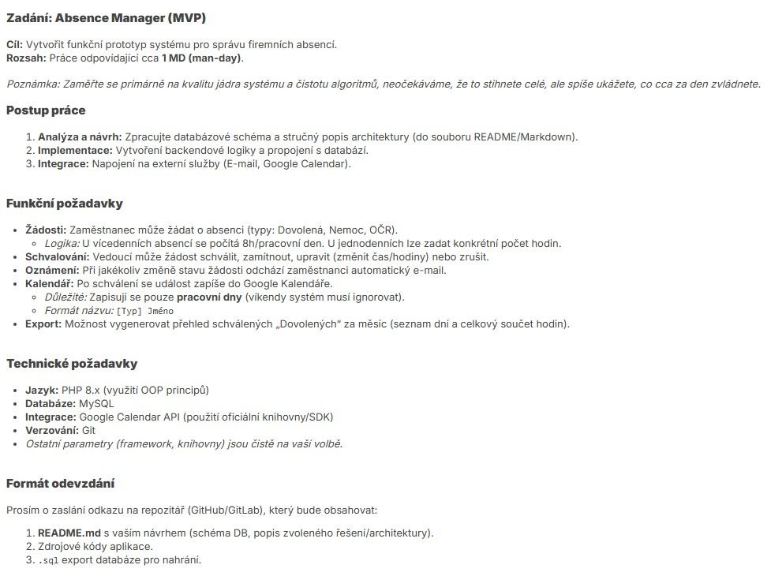
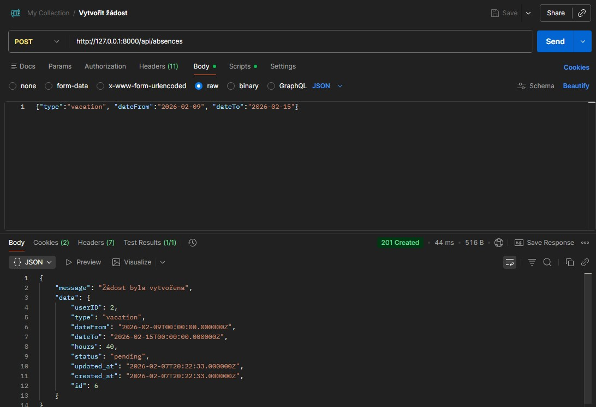
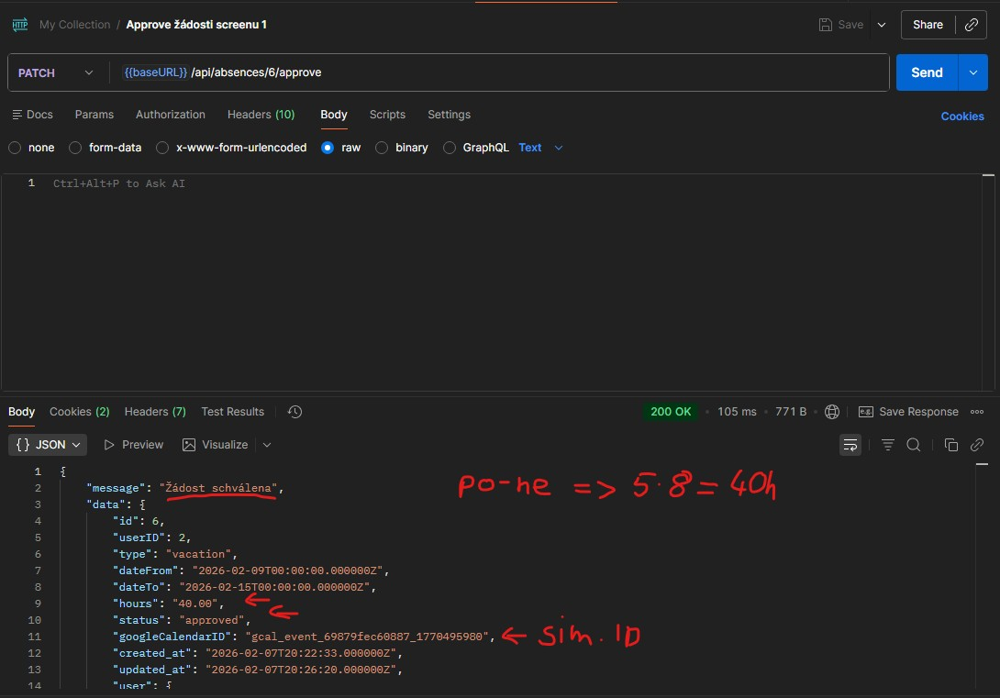
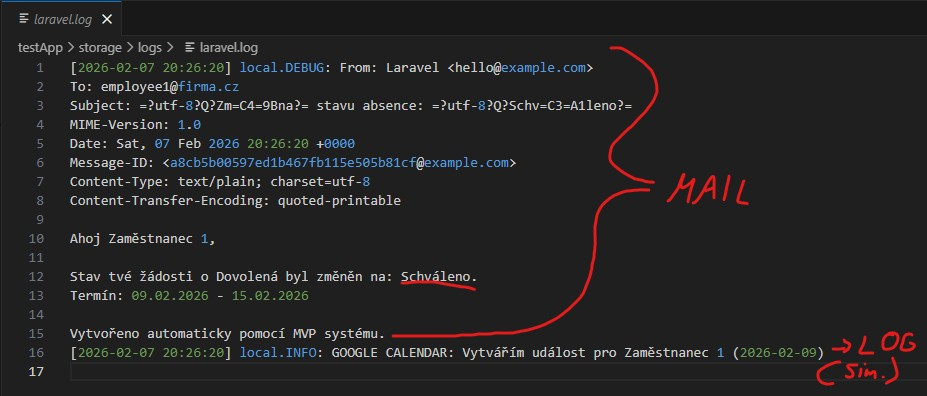
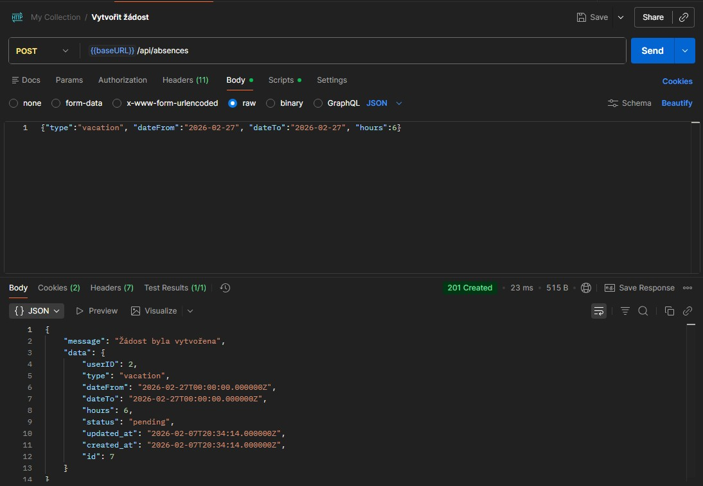
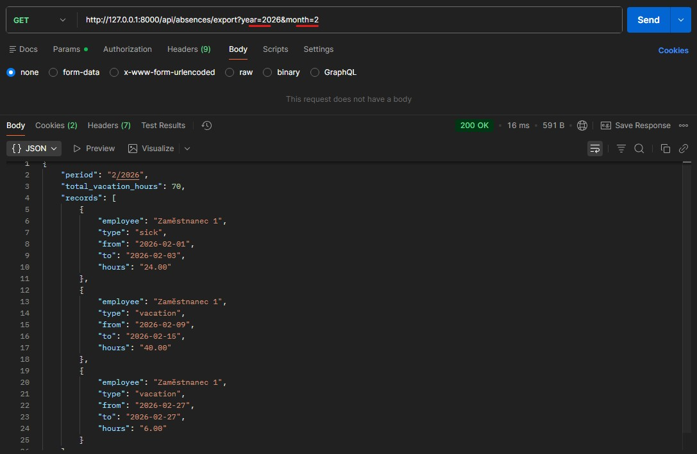
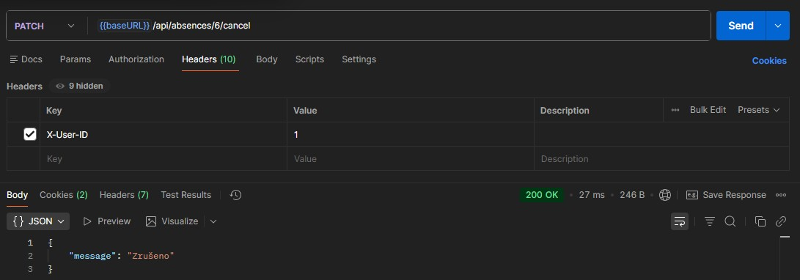
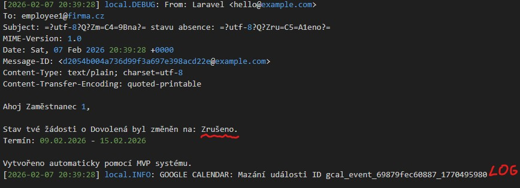

# Zadání:

# Analýza DB:
Bude potřeba mít model uživatele a absence.
Uživatel musí mít rozlišení rolí, aby vedoucí mohl schvalovat neschválené volna zaměstnanců.
Absence bude obsahovat typ, bude patřit (BelongTo) uživateli, který ji vytvořil. Dále musí obsahovat typ absence a začátek + konec a hodiny. Hodiny použiju u jednodenních absencí pro zadání počtu hodin. Pokud se jedná o více dní, tak při zadávání datumů se vypočítá počet hodin celkem. (Přepřipraveno pro export). V návrhu databáze nepočítám s možností, že systém pracuje i s časem - nepůjde zadat přesný čas odchodu, ale pouze rozsah dní nebo jednodenní volno a počet hodin, co bude zaměstnanec pryč. Dále bych mohl ukládat například atribut který vedoucí schválil volno nebo záznam důvodu nepřijetí,.. ale nepřijde mi to pro prototyp podstatné.

V ER diagramu jsou popsány Enum tabulky, které samozřejmě nebudou řešeny na úrovni databáze, ale pro přehlednost jsem je zde zakreslil. Zrušení žádosti jsem si interpretoval jako smazání záznamu a informování uživatele, že byla žádost zrušena.

# Další postup:
## A (začátek a plánování implementace)
- Pro urychlení práce jsem se rozhodl použít Laravel, abych se většinu času mohl věnovat napojení na API a logice místo napojování MySQL a routování a řešení mailů. Jako druhý důvod zvolení Laravelu je, že je to jediný framework, se kterým mám zkušenosti.
- Views budu dělat jako poslední, pokud mi zbyde čas a budou z většiny generované (views beru jako nejméně prioritní v tomto zadání - nejsou ani zmíněné)
- Po analýze budu pracovat na vytvoření modelů. Pozn.: Pro uživatele jsem nedělal ruční model a migraci a použil tu výchozí.
- Poznánka: Views určitě nestihnu..

## B (implementace BE logiky)
- Dále bude potřeba vytvořit logiku žádostí. Nebyl jsem si jistý, zda čistá logika žádostí (počítání hodin a ignorování víkendů,..) se hodí implementovat v Controlleru (moje jediná zkušenost). Pomocí LLM jsem se dozvěděl, že mám pracovat se Services. Hlavní důvodem jsem pochopil, že je lepší modularita a testovatelnost. Controller bych měl použít pouze pro validaci/auth/response logiku.
- U jednodenní žádosti stačí zkontrolovat, zda jsou zadané hodiny, co chce být zaměstnanec pryč nebo je nastavit na 8h (celý den).
- U vícedenního volna zjistím počet dní, odstraním víkendy a pronásobím hodinami (8h/den) a uložím do atributu "hours".
- Po vytvoření logiky musím vytvořit Event pro tvorbu emailů při změně stavu žádostí.
- Jakmile budu hotový, tak je potřeba vytvořit controller pro žádosti, který bude validovat vstupy a poté otestovat.
- artisan tinker test: Funguje vytvoření uživatelů a žádostí a schválení. Pokud se změní stav, tak v logu správně vidím příchozí mail.
- TODO: před dalším commitem: Dodělat controller a otestovat API

## C (plán na konec)
- cca poslední 1,5 h z 1 MD
- Plánuji připravit export měsíce, template/rozhraní pro Google Calendar API, vygenerovat pomocí LLM seedery databáze a vyzkoušet funkce pomocí Postman a dokumentovat veškerou práci, kterou jsem stihl.

## Závěr (konec po cca 8h):
- Dodělal jsem export v podobě json
- Google Calendar jsem bohužel nestihl implementovat a mám pouze kostru chování, která zároveň s potvrzujícím emailem volá také uložení do Google kalendáře, ale pouze se napíše log záznam a vytvoří náhodné ID pro simluaci možného fungování. Taktéž při smazání se toho volá funkce, simulující odstranění záznamu na Google.
- Hotové celky: Funkční logika databáze uživatelů a žádostí o volno. Správně se počítá bez víkendů. Pro rychlejší testování existuje AbsenceController, který se chová jako API na endpointech viz routes/api.php (fotky z Postman testování níže). Při používání API je třeba využívat jednoduchou autentizaci v podobě hlavičky HTTP requestu - X-User-ID: "userID". Chybí napojení na Google API.

## Zhodnocení
- V průběhu implementace jsem prioretizoval logiku ukládání a počítání dní. Jakmile jsem měl funkční prototyp, vrhnul jsem na tvorbu Eventů a Listenerů a implementoval Email notifikace při změně stavu žádosti. Jako poslední jsem si nechal export všech záznamů jednoho měsíce a napojení na Google API.
- Během práce jsem si postupně trackoval čas a snažil se dodržet cca 8 hodin. Ke konci jsem došel k závěru, že Google API ani nějaké základní Views nemám šanci stihnout, pokud bych nezvolil cestu slepý vibecoding (Ctrl+C/Ctrl+V) a raději obětoval nějaký čas pro dokumentaci a spíš jsem se snažil přiblížit reálné maximum, co jsem za den schopný stihnout pokud kombinuji LLM/Copilot a zároveň vím, co píšu a jen slepě nekopíruju.

## Screenshoty z testování API
### Podání žádosti o volno

### Schválení volna (vedoucím)

### Email o schválení

### Podání žádosti o část z jednoho dne

### Export všech schválených absencí jednoho měsíce

### Zrušení volna

### Email o zrušení
